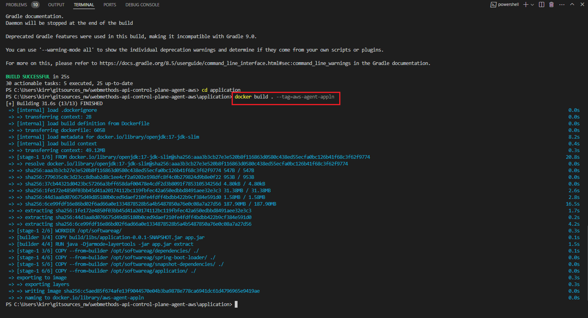
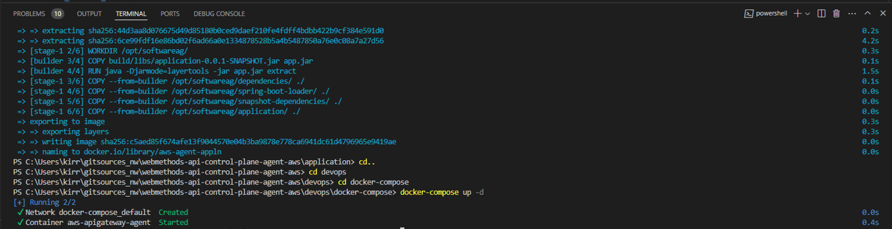

## How to Deploy and Run the AWS Agent as a Spring Boot application in Docker?

Let’s look at a sample scenario through which you can deploy the AWS Agent as a spring boot application in Docker using Visual Studio Code editor. To deploy the AWS Agent in AWS Lambda, see [How to deploy the AWS Agent in AWS Lambda?](../functions)

**Note**: ``` This procedure explains how to deploy the AWS agent as a stand-alone application. ```

**Pre-requisites**

Ensure that you have:

- Built the Gradle project and the *application-<version>-SNAPSHOT* Jar is created at *application / build / libs*<br>
  For details about how to build the Jars, see [How to build?](../devops/)
- Started the Docker client.
- API Control Plane, version *11.0.3*
- Verified if Amazon API Gateway and API Control Plane for which you want to establish connectivity using the Agent are up and running.
- Created the *Runtime Type* in API Control Plane to represent Amazon API Gateway. For details, see [How to create the runtime type?](../docs/runtime_service_mgmt_api.md)
- Created an IAM user in AWS with the following roles assigned:
	 - **AmazonAPIGatewayAdministrator**
	 - **AWSCloudTrail_ReadOnlyAccess**
	 - **CloudWatchReadOnlyAccess**
	 
**To build a Docker image**

1.	Go to *webmethods-api-control-plane-agent-aws\application* using the following command in the Visual Studio Terminal:
	 ``` cd application ```

2.	Run the following command to build the Docker image:
	 ``` docker build . --tag=<image-name> ```

	 For example: docker build . --tag=aws-agent-appln
	 
      
	 
      Verify if *aws-agent-appln* image is listed in the docker client or run the following command to verify if the image is listed in the docker images:

	  ``` docker images ```
	 
	 
## How to run the AWS Agent as a Spring Boot application in Docker?

Let’s look at a sample scenario through which you can run the AWS agent as a spring boot application in Docker using Visual Studio Code editor.

**To run the Spring boot application in Docker**

1.	Configure API Control Plane agent with a set of properties.

	 Go to *webmethods-api-control-plane-agent-aws\devops\docker-compose* using the following commands in the Visual Studio Terminal:

	 ``` cd devops ```
	 
	 ``` cd docker-compose ```

.env and docker-compose.yml file contains properties related to Amazon API Gateway configurations, Agent configurations, Runtime configurations, and API Control Plane configurations. 

**Note**: ``` The following properties apply to both Sprint boot and AWS Lambda deployment modes. ```

**Amazon API Gateway configurations** let you specify Amazon API Gateway configurations required for AWS connectivity.

| Properties | Description |
|--------------------|-------------------|
| AWS_AGENT_IMAGE | Docker Image name. |
| AWS_REGION | The region name in which the Amazon API Gateway service is hosted. <br><br> *This property is not applicable for AWS Lambda deployment*. Ensure to create an AWS Lambda function in the same region where Amazon API Gateway is hosted.  |
| AWS_STAGE | Stage (Runtime) name in Amazon API Gateway. |
| AWS_ACCESS_KEY_ID| Access key of the IAM user.<br>Use the property only if you have specified the *ENV_VARIABLE* as **AWS_CREDENTIALS_PROVIDER**. For details about various credential providers supported by the Agent SDK, see [Authentication](../docs/authentication.md). <br><br> *This property is not applicable for AWS Lambda deployment*. |	 
| AWS_SECRET_ACCESS_KEY |Secret key of the IAM user. <br>Use the property only if you have specified the *ENV_VARIABLE* as **AWS_CREDENTIALS_PROVIDER**. For details about various credential providers supported by the Agent SDK, see [Authentication](../docs/authentication.md). <br><br> *This property is not applicable for AWS Lambda deployment*.|
| AWS_METRICS_BY_DATA_OR_STATISTICS | Method in which the metrics are retrieved from CloudWatch.<br>Values:<ul><li>Data</li><li>Statistics</li></ul> |
| AWS_METRICS_SYNC_BUFFER_INTERVAL_SECONDS| By default, Amazon API Gateway metric data is automatically sent to Amazon CloudWatch in one-minute interval. That is, most Amazon API Gateway metrics will be available in Amazon CloudWatch within 1 minute of the original data point.<br><br>Therefore, set CloudWatch buffer time interval as more than 60 seconds (1 minute). |	 
| AWS_ASSETS_SYNC_BUFFER_INTERVAL_SECONDS | CloudTrail typically delivers API Gateway management events within about 5 minutes of the API call being made. This is the standard delivery time for CloudTrail events.<br><br>Therefore, set CloudTrail event time interval as more than 300 seconds (5 minutes).|	 

**Agent configurations** let you specify the Agent configurations such as heart beat interval, assets sync interval, metrics sync interval, and so on.

| Properties | Description | Possible Values |
|--------------------|-------------------|-------------------|
| APICP_PUBLISH_ASSETS | Enable or disable the publishing of assets to API Control Plane. | <ul><li>true</li><li>false</li></ul><br>Assets are published to API Control Plane whenever the Agent starts, provided that **publishAssets** is set to true |
| APICP_SYNC_ASSETS  | Enable or disable syncing of assets to API Control Plane. | <ul><li>true</li><li>false</li></ul><br>Assets are synchronized periodically according to the configured synchronization values. Within each synchronization interval, only the assets that are newly created, updated, or deleted are synchronized with API Control Plane.|
| APICP_SEND_METRICS   | Enable or disable sending API metrics to API Control Plane. | <ul><li>true</li><li>false</li></ul>|
| APICP_HEARTBEAT_SEND_INTERVAL_SECONDS   | The duration in seconds in which the Agent must send the health check status to API Control Plane. |Min: 15 seconds<br>Max: 900 seconds (5 minutes).  |
| APICP_ASSETS_SYNC_INTERVAL_SECONDS   | The duration in seconds in which the Agent must synchronize the changes made to the assets from the Amazon CloudTrail to API Control Plane. |Min: 60 seconds<br>Max: 21600 seconds (6 hours). |
| APICP_METRICS_SEND_INTERVAL_SECONDS   | The duration in seconds in which the Agent must retrieve the metrics from Amazon CloudWatch and send metrics to API Control Plane. | Supported metric synchronization values: <br> <ul><li>60 seconds (1 minute)</li><li>300 seconds (5 minutes)</li><li>600 seconds (10 minutes)</li><li>1800 seconds (30 minutes)</li><li>3600 seconds (60 minutes)</li><li>7200 seconds (120 minutes)</li></ul>|


**Runtime configurations** lets you specify the metadata of Amazon Gateway that you want to administer from the API Control Plane such as Runtime name, Description, Tags, and so on.

| Properties | Description |
|--------------------|-------------------|
| APICP_RUNTIME_NAME |	*Mandatory*. The runtime name. <br> This property defines how you want to identify the runtime in API Control Plane.<br>Name must not exceed 50 characters.|
| APICP_RUNTIME_DESCRIPTION | *Optional*. The runtime description. <br>Description must not exceed 300 characters. |
| APICP_RUNTIME_REGION | *Mandatory*. The region name where the runtime is hosted. <br>Example: EAST US <br>Region name must not exceed 50 characters.|
| APICP_RUNTIME_LOCATION| *Optional*. The location where the runtime is deployed. <br>Example: DENVER<br>Location name can not be empty and must not exceed 50 characters.|	 
| APICP_RUNTIME_TAGS |*Mandatory*. The tag name of the runtime. <br>Tags are used to organize and categorize the runtimes. Multiple tags can be specified by adding comma.<br>Example: test, local, dev<br> Tags must not exceed 50 characters. It must not contain whitespaces and the number of tags must not exceed 100.|
| APICP_RUNTIME_CAPACITY_VALUE | *Optional*. The number of transaction calls that a runtime can process for the specified duration. You can configure the capacity value with any non-negative integer  |
| APICP_RUNTIME_CAPACITY_UNIT| You can configure the capacity value with any non-negative integer and for any duration which can be in the following units:<ul><li>per second</li><li>per minute</li><li>per hour</li><li>per day</li><li>per week</li><li>per month</li><li>per year</li></ul>|	 
| APICP_RUNTIME_TYPE_ID | *Mandatory*. The Id of the runtime type. <br>Pre-defined types: WEBMETHODS_DEVELOPER_PORTAL, WEBMETHODS_API_GATEWAY<br>Ensure to verify if the runtime type exists in API Control Plane. If it does not exist, use the Runtime Type Management Service REST API to add the runtime type. For details, see [How to create the runtime type?](../docs/runtime_service_mgmt_api.md)|	


**API Control Plane configurations** let you specify API Control Plane details to which Amazon API Gateway must establish the connectivity.

| Properties | Description |
|--------------------|-------------------|
| APICP_URL |	*Mandatory*. The valid URL that is used to access API Control Plane.|
| APICP_USERNAME | *Mandatory*. User name that is used to log in to API Control Plane. |
| APICP_PASSWORD | *Mandatory*. Password of the corresponding user name, which is used for logging into the API Control Plane through basic authentication.|
| APICP_SSL_ENABLED | Possible values: *true* or *false*|	 
| APICP_TRUSTSTORE_PATH |Location of the truststore file.|
| APICP_TRUSTSTORE_PASSWORD | Password to access the truststore file. |
| APICP_TRUSTSTORE_TYPE| Type of the truststore.|	
| APICP_KEYSTORE_PATH | Location of the keystore file.|	 
| APICP_KEYSTORE_PASSWORD |Password to access the keystore file.|
| APICP_KEYSTORE_TYPE | Type of the keystore. |
| APICP_KEY_ALIAS | Alias of key in the keystore.|	
| APICP_KEY_PASSWORD | Password of key in the keystore.|	


2. Run the following command:

	``` docker-compose up -d ```

	 The output must be as follows:



The Agent application starts. 

3. Verify if AWS API Gateway(runtime) is registered with the API Control Plane and if the APIs and metrics are published and synchronized with API Control Plane respectively.

   1. Open the API Control Plane application.
   2. Click on the **Runtimes** tab.<br><br>
   *To check if the runtime is registered with API Control Plane*:<br><br>
   4. Check if the *APICP_RUNTIME_NAME* (specified in the .env file) is listed in the *Manage Runtimes* page.
      If the runtime is listed, it indicates that the runtime is successfully registered with the API Control Plane.<br><br>
   *To check if the runtime's health status is sent to API Control Plane:*<br><br>
   6. Check the status of that corresponding runtime in the Status column.
      The status appears *green* only if the runtime is up and the heartbeats (status) are received successfully by the API Control Plane.<br><br>
   *To check if the APIs are published from the runtime to API Control Plane*:<br><br>
   8. Click **Action menu** > **Details** of the corresponding runtime for which, you want to verify if its APIs are published to API Control Plane.
   9. Click **APIs** tab.<br>
      A list of all the APIs associated with the runtime appears. You can also view the runtimes and its associated APIs in the *Manage APIs* page.<br><br>
   *To check if the API metrics are synchronized from the runtime to API Control Plame*:<br><br>
   10. Click the icon under the **Action** column corresponding to the runtime for which, you want to verify if the metrics are published to API Control Plane.
       The *Runtime-specific* monitor page renders the metrics of that runtime pertaining to a specified time interval. It lists the metrics such as *Transactions*, *Error rate*, *Availability*, *Response time*, and so 
       on. For details, see [Monitoring Runtimes](https://docs.webmethods.io/apicontrolplane/manage_runtimes/chapter5wco/#monitoring-a-specific-runtime&gsc.tab=0).


