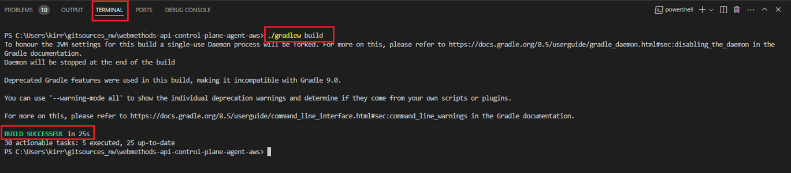

## How to build the Gradle project?

Let’s look at a sample scenario through which you can build a Gradle project using Visual Studio Code editor.

**Pre-requisites** 

Ensure that you have

- Cloned **webmethods-api-control-plane-agent-aws** Git Hub repository using any GIT client.
- Empower portal login credentials to download the Agent SDK Jars. For details, see [How to access Agent SDK Jars](https://docs.webmethods.io/apicontrolplane/agent_sdk/chapter2wco#ta-implementing_agentsdk).
- Copy and paste the Agent SDK (api, core, and model) Jars from the extracted folder into the [Libs](../libs) directory in the cloned (api-controlplane-agent-aws) repository.


**To build the Gradle project**

1.	Unzip Agent SDK folder downloaded from the Empower portal and place the (api, core, and model) Jars under *lib* folder in the cloned repository.

2.	Open Visual Studio Code editor.

3.	Go to **File > Open Folder** and select the cloned **webmethods-api-control-plane-agent-aws** repository.

4.	Run the following command in the Visual Studio Terminal to build the project:

	 ``` ./gradlew build ```

	 

   *Build Successful* message appears, and the following Jars are created for the application and Lambda functions:

   **Spring Boot application**: **application-<version>-SNAPSHOT** is created at *application / build / libs* <br>
   
   **AWS Lambda**: <br>
	- **lambda-layer.zip** is created at *functions / build / libs*, which includes all dependencies to run lambda function.<br>
	- **send-asset.jar** is created at *functions / send–asset  / build / libs* <br>
	- **send-heartbeat.jar** is created at *functions / send-heartbeat / build / libs* <br>
	- **send-metrics.jar** is created at *functions / send-metrics / build / libs*

