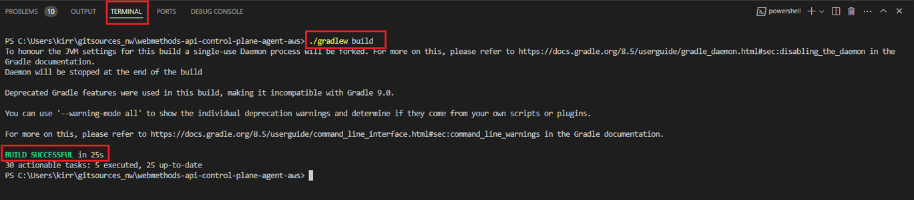

## How to build the Gradle project?

**Pre-requisites:** Ensure that you have:

- Access to Agent SDK Jars in Empower portal. For details, see [How to access Agent SDK Jars](https://docs.webmethods.io/apicontrolplane/agent_sdk/chapter2wco#ta-implementing_agentsdk).
- Cloned webmethods-api-control-plane-agent-aws Git Hub repository using any GIT client.


**To build the Gradle project**

Let’s look at a sample scenario through which you can build a Gradle project using Visual Studio Code editor.

1.	Unzip Agent SDK folder downloaded from the Empower portal and place the (api, core, and model) Jars under lib folder in the cloned repository.

2.	Open Visual Studio Code editor.

3.	Go to File > Add Folder to Workspace and select the cloned **webmethods-api-control-plane-agent-aws** repository.

4.	Run the following command in the Visual Studio Terminal to build the project:

	 ``` ./gradlew build ```

	 

   *Build Successful* message appears, and the Jars are created for the application and Lambda functions.

