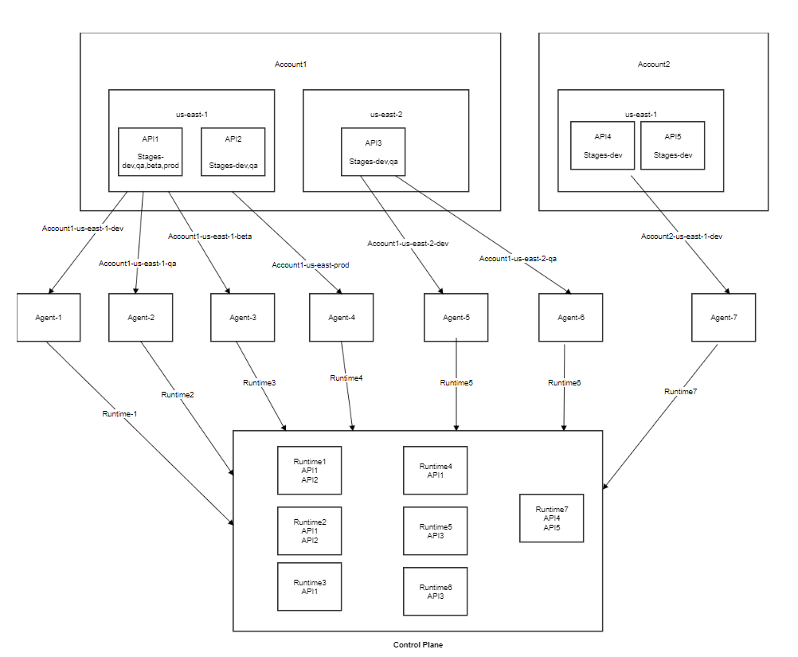

## Co-relation between Amazon API Gateway and API Control Plane terminologies

| Amazon API Gateway | API Control Plane | Description |
|--------------------|-------------------|-------------|
| Stage |Runtime | A stage in Amazon API Gateway is considered as a runtime in API Control Plane. |
| Deployment | API Versions | A deployment in Amazon API Gateway is a snapshot that tracks an API's version. An API in Amazon API Gateway can have multiple deployments, but only one can be active per stage at a time.    In the API Control Plane, each deployment is called an API version. For example, if an API has two deployments published to two different stages, it is treated as two different versions of the same API in API Control Plane.  |

## How to identify a unique stage in Amazon Gateway?

Every unique *stage* within each region in AWS API Gateway is considered as a separate runtime in the API Control Plane. Hence, you must deploy an agent for each unique stage.

For example: Assume that you have two accounts in **AWS** and each account has **AWS API Gateway** with APIs in the following regions and stages:

**Account 1**:
- *Region 1*: us-east-1
    - *Stage*: dev (In APICP, this stage appears as **dev-account1-ue1** runtime from account 1 in region us-east-1)
       - *API*s: API1, API2
    - *Stage*: qa (In APICP, this stage appears as **qa-account1-ue1** runtime from account 1 in region us-east-1)
       - *APIs*: API1, API2
- *Region 2*: us-east-2
    - *Stage*: dev (In APICP, this stage appears as **dev-account1-uw2** runtime from account 1 in region us-east-2)
       - APIs: API3
    - *Stage*: preprod (In APICP, this stage appears as **preprod-account1-uw2** runtime from account 1 in region us-east-2)
       - *APIs*: API3
    - *Stage*: prod (In APICP, this stage appears as **prod-account1-uw2** runtime from account 1 in region us-east-2)
       - *APIs*: API3

**Account 2**:
- *Region 1*: us-east-1
    - *Stage*: dev (In APICP, this stage appears as **dev-account2-ue1** runtime from account 2 in region us-east-1)
      - *APIs*: API4
    - *Stage*: prod (In APICP, this stage appears as **prod-account2-ue1** runtime from account 2 in region us-east-1)
      - *APIs*: API4

Please see the following diagram to understand how the stages are treated as different runtimes in the API Control Plane.

