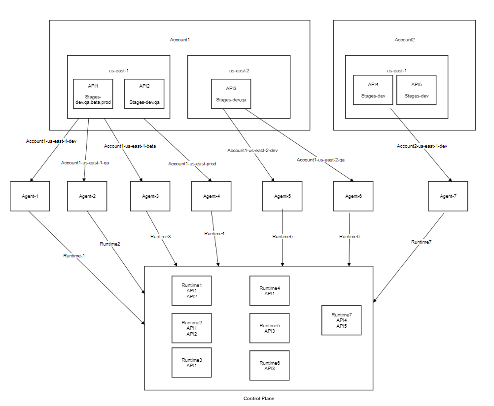

## Co-relation between Amazon API Gateway and API Control Plane terminologies

| Amazon API Gateway | API Control Plane | Description |
|--------------------|-------------------|-------------|
| Stage |	Runtime Co-relation between Amazon API Gateway and API Control Plane terminologies | A stage in AWS API Gateway is considered as a runtime in API Control Plane. |
| Deployment | API Versions | A deployment is a snapshot of an API, which tracks the version of an API.    An API in AWS API Gateway can have multiple deployments. Whereas only one deployment can be active at any time in the stage. |

For AWS API Gateway, you must develop an Agent for each distinct Stage. For example:

If ‘API1’ and ‘API2’ are deployed across stages, 'dev' and 'qa' in 'us-east-1' region under 'account1', 2 runtimes are required. That is, an Agent must be deployed for ‘dev’ and ‘qa’ each.

If 'API3' is deployed across stages, 'dev', 'pre-prod', and 'prod' in 'us-east-2' region under 'account1', 3 more runtimes are required. That is, an Agent must be deployed for ‘dev’, ‘pre-prod, and ‘prod’ each.

If 'API4' is deployed across stages, 'dev' and 'prod' in 'us-east-1' region under 'account2', 2 additional runtimes are required. That is, an Agent must be deployed for ‘dev’ and ‘prod’ each.

The following figure helps you identify the distinct stage:

