## How AWS Lambda works?

The Lambda function is the principal resource that you can invoke to run your application code in Lambda. A function has code to process the events that you pass into the function. You must configure a Lambda function for each functional use case that an agent can perform. Once configured, the Lambda function gets automatically invoked when an event occurs. For more details, see [Functions](https://docs.aws.amazon.com/whitepapers/latest/security-overview-aws-lambda/lambda-functions-and-layers.html).


## AWS Lambda Implementation Overview

The sample implementation leverages the following AWS services, which allows you to:

- **AWS CloudWatch** - Retrieve API metrics.

- **AWS CloudTrail** - Retrieve API activity.

- **AWS EventBridge Scheduler** - Create, run, and manage scheduled tasks at scale. With EventBridge Scheduler, you can schedule one-time or recurrently tens of millions of tasks without provisioning or managing the underlying infrastructure.


## Artifacts to configure AWS Lambda Functions and their Capabilities

Let’s understand the functions you must configure for each use case of an agent. For details about the use cases of an AWS agent and its core implementation logic, see [Core Implementation Logic](../docs/core-logic.md).

- **Retrieving Amazon API Gateway's health status (heartbeats) and sending it to API Control Plane**.<br>
  In order to perform this functionality, create a Lambda function using **send-heartbeat.jar**, which is generated when the Gradle project is built. For details about how to build the   Jars, see [How to build?](../devops/)
  
- **Synchronizing assets between Amazon API Gateway and API Control Plane**.<br>
  In order to perform this functionality, create a Lambda function using **send-asset.jar**, which is generated when the Gradle project is built.
  
  This Lambda function handles publishing and synchronizing of assets with API Control Plane.
  
  1. The Lambda function publishes all Amazon API Gateway’s assets (APIs) to API Control Plane during its initial invocation if *APICP_PUBLISH_ASSETS* Environment   	  variable is set to *true*.
  2. In subsequent invocations, assets are synchronized periodically according to the synchronization values configured while creating this Lambda function. Within 	 each synchronization interval, only the assets that are newly created, updated, or deleted are synchronized with API Control Plane.

- **Retrieving metrics from Amazon API Gateway and sending it to API Control Plane**. <br> 
  In order to perform this functionality, create a Lambda function using **send-metrics.jar**, which is generated when the Gradle project is built.
  
**Note**: All three corresponding Lambda functions handle the **registration of Amazon API Gateway in API Control Plane**.<br>
The registration functionality  occurs only once, during the first time the runtime (Amazon API Gateway) is connected to the API Control Plane. The Lambda function registers the runtime in API Control Plane only if the runtime does not exist in API Control Plane. On subsequent registrations, API Control Plane indicates the agent (Lambda functions) that the runtime already exists in API Control Plane and the existing runtime is used. For example, if all of the above three lambda functions use the same *runtime id* and *runtime name* during their respective first invocation, only the first executed Lambda function creates a runtime in the API Control Plane. The remaining two Lambda functions use the same runtime created by the first Lambda function.
  
The registration logic and **Publish Assets** logic is written as [initialization code](https://docs.aws.amazon.com/lambda/latest/dg/java-handler.html#java-initialization-code) in AWS Lambda. This logic runs only during the [init phase](https://docs.aws.amazon.com/lambda/latest/dg/lambda-runtime-environment.html#runtimes-lifecycle-ib) when the lambda is deployed in the Lambda runtime environment.


## How to deploy the AWS Agent in AWS Lambda?
Let’s look at a sample scenario through which you can configure a Lambda function, **Heartbeatshandler** (for retrieving AWS API Gateway’s health status and sending it to API Control Plane) using the *Lambda console*. 

**Pre-requisites**

Ensure that you have

- Built the Gradle project and the following Jars are created. For details about how to build the Jars, see [How to build?](../devops/)
	- **lambda-layer.zip** is created at *functions / build / libs*, which includes all dependencies to run the lambda function.
	- **send-asset.jar** is created at *functions / send–asset / build / libs*, which has the core implementation logic for synchronizing the API events from AWS API Gateway to API Control Plane.
	- **send-heartbeat.jar** is created at *functions / send-heartbeat / build / libs*, which has the core implementation logic for retrieving and sending the heartbeats (status) from the AWS API Gateway to API 
            Control Plane.
	- **send-metrics.jar** is created at *functions / send-metrics / build / libs*, which has the core implementation logic for retrieving and synchronizing the metrics from the AWS API Gateway to API Control Plane.<br>
- API Control Plane, version 11.0.3
- Verified if AWS API Gateway and API Control Plane for which you want to establish connectivity using the agent are up and running.
- Created the Runtime Type in API Control Plane to represent Amazon API Gateway. For details, see [Runtime Type Management REST API](https://github.com/SoftwareAG/webmethods-api-control-plane/blob/main/apis/openapi-specifications/runtime-type.yaml). 
- Created an IAM user in AWS with the following roles assigned:
	 - **AmazonAPIGatewayAdministrator**
	 - **AWSCloudTrail_ReadOnlyAccess**
	 - **CloudWatchReadOnlyAccess**
	 - **AWSLambdaBasicExecutionRole**. For more details, see [Lambda Execution Role](https://docs.aws.amazon.com/lambda/latest/dg/lambda-intro-execution-role.html).
	 
**To deploy an agent in AWS Lambda**

**Step 1. Create a Lambda function, Heartbeatshandler.**<br>
**Note**: ``` Ensure to create the Lambda function in the same region where Amazon API Gateway is hosted. ```

a. Open AWS Lambda Service.<br>
   By default, the Functions page of AWS Lambda console opens.
   
b. Click **Create Function**.

c. Select **Author from scratch**.

d. Edit the following details as required in the **Basic information** section:
- **Function name**. Enter a name that describes the purpose of your function.<br> For example: **Heartbeatshandler**.
- **Runtime**. Choose **Java 17** as the language to write your function.
- **Architecture**. Choose **x86_64** as the instruction set architecture for your function code.
- Click **Create Function**.
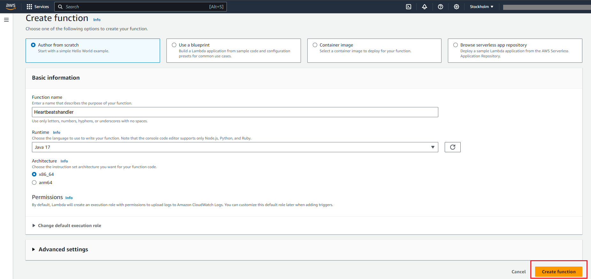
Lambda creates a function, *Heartbeatshandler*, which is listed under *Functions*.

**Step 2: Configure a Lambda Layer**

A Lambda layer is a .zip file archive that contains the dependencies for the agent to run. Uploading the dependencies in the Layer reduces the size of the deployment package, separates core function logic from dependencies, and lets you share the dependencies across multiple functions.

a. Click **Additional resources > Layers** from the left navigation pane.

b. Choose **Create Layer**.

c. Edit the following details as required:

- **Name**. Enter a Layer name. <br> For example, **AWSLambdaLayer**
- Upload the dependencies Jar.<br>
  Choose Upload a **.zip file >upload** and select the *lambda-layer.zip* located at *functions / build / libs*, which includes all dependencies to run the Lambda function.<br>
  **Note**: ``` If the size of the lambda-layer.zip file is more than 10 MB, upload the file to Amazon S3 bucket and select the S3 bucket link in this step. ```
- **Compatible architectures**. Choose **x86_64** as the compatible architecture.
- **Compatible runtimes**. Choose **Java 17**.
- Click **Create**.<br>
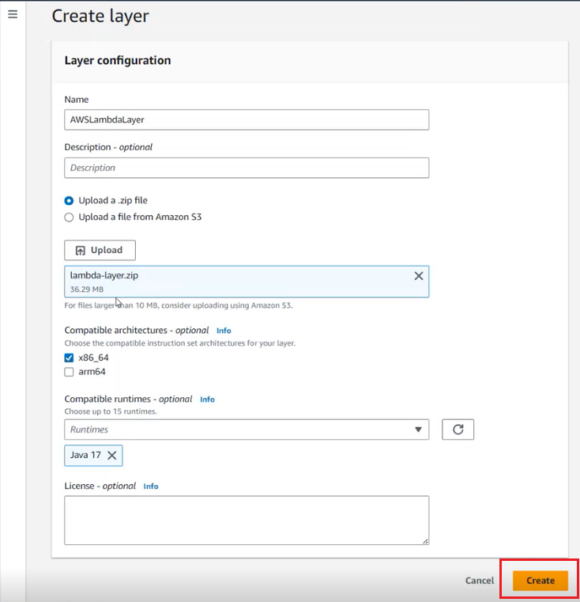<br>
The Lambda layer, *AWSLambdaLayer* is created, which can be configured in all the Lambda functions.

**Step 3: Specify the required configurations for the Lambda function, Heartbeatshandler to run.**

a. Click **Functions** from the left navigation pane.<br>
b. Choose **Heartbeatshandler** function.<br>
c. Select the **Code** tab.<br>

**To add the configurations for *Heartbeatshandler* function**:

1. Configure the Lambda Layer, *AWSLambdaLayer* for the Lambda function, *Heartbeatshandler*.

	1. Select **Layers** and click **Add a Layer**.
	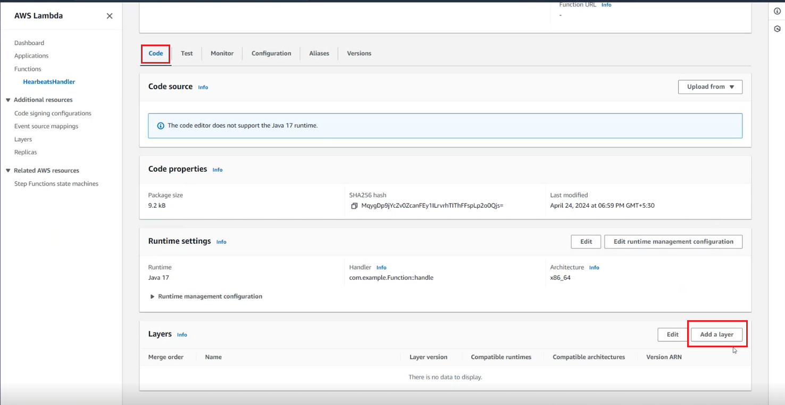
	2. Choose the Layer source as **Custom Layers**.
	3. Select **AWSLambdaLayer** in the Custom Layers drop down menu.
	4. Choose the Version as **1**.
	5. Click **Add**.
	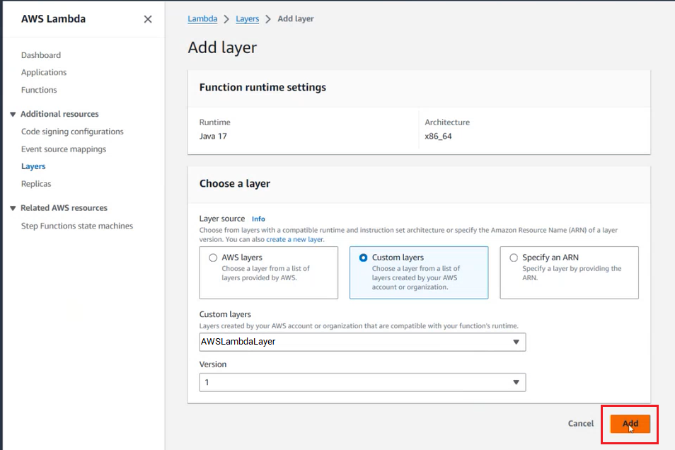
	*AWSLambdaLayer* is added to the *Heartbeatshandler* function.

2. Upload the Heartbeat Jar.

	1. Select **Code source > Upload** and select the **send-heartbeat.jar** located at *functions / send-heartbeat / build / libs*.
	2. Click **Save**.
	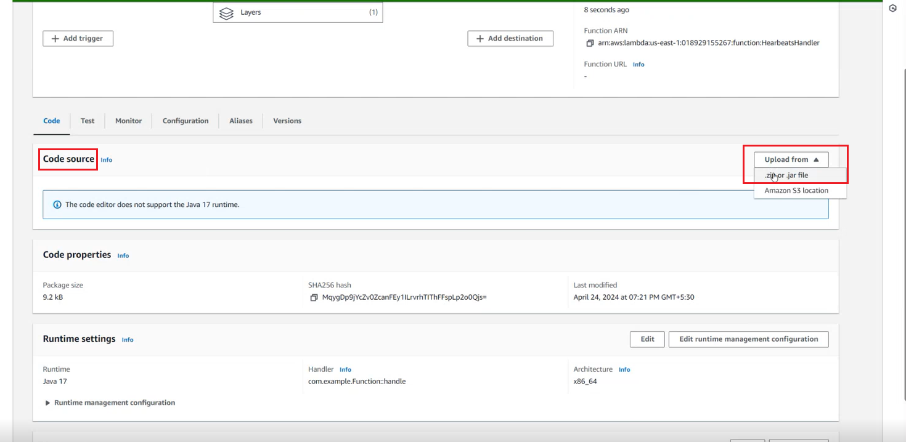
	The *send-heartbeat.jar* is uploaded. You can verify the *package size* under *code properties* to know if the Jar is uploaded.


3. Specify the runtime settings.

	1. Click **Edit**. 
	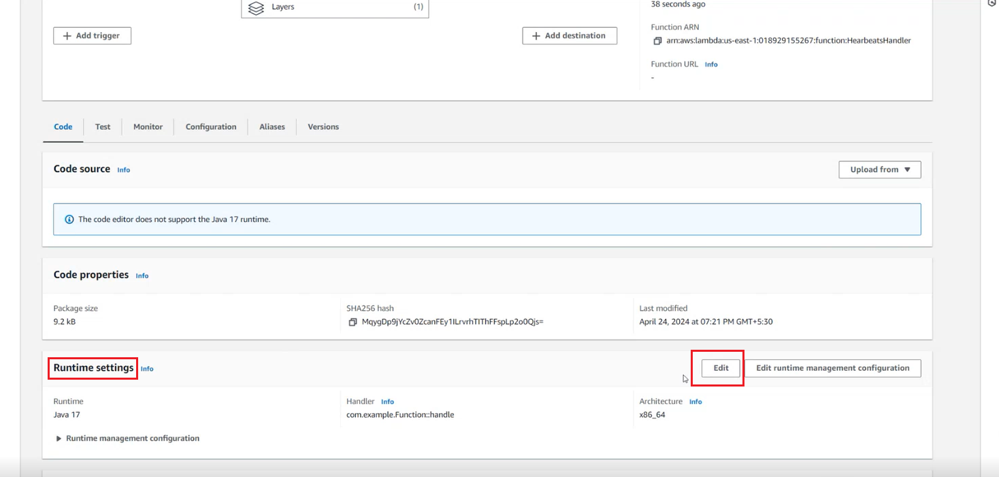
	2. **Handler**. Specify the *Class* and *Method* name from the **send-heartbeat.jar**, which triggers when the **Heartbeatshandler** function is invoked.
	By default, ``` com.example.Function::Handle ``` is populated in the field.<br>
	Here, **com.example.Function** must be replaced with the **Class name** and **Handle** must be replaced with the **Method name** from **send-heartbeat.jar**<br>
	**To identify the Class name**:<br> 
	Go to **send-heartbeat.jar** in any IDE such as IntelliJ or Visual Studio Code and select **Functions > send-heartbeat > build > src > main > FunctionHandler**,  right click and copy the reference.
	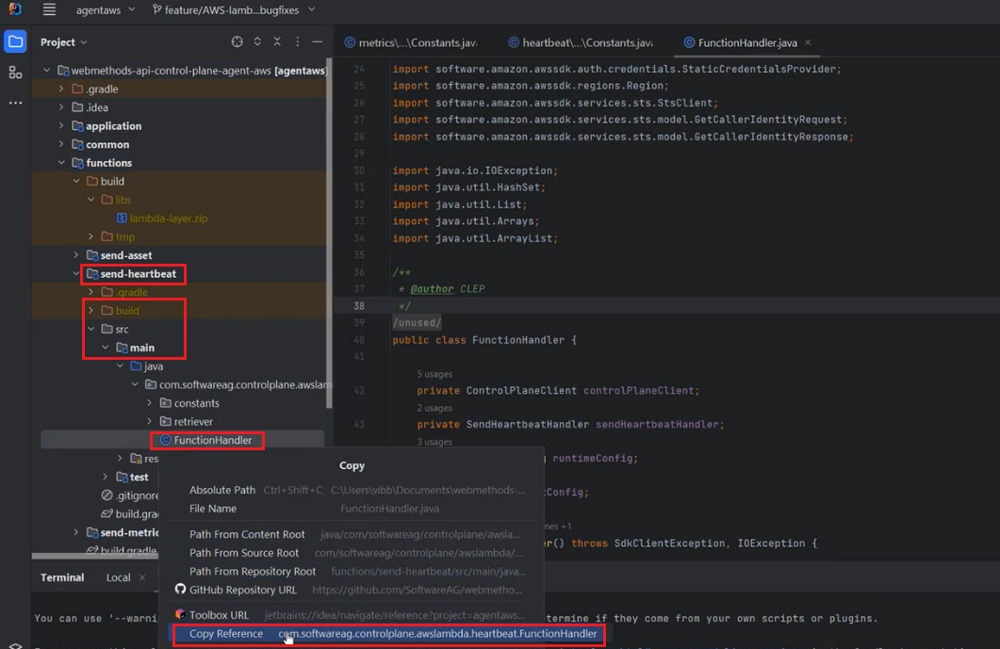
	Paste the reference in the default value in the field.<br>
	For example, **com.softwareag.controlplane.awslambda.heartbeat.FunctionHandler**::Handle<br><br>
	**To identify the Method name**:<br>
	In the **FunctionHandler** Class, **handleEvent** is the method that is invoked with every Lambda function, *Heartbeatshandler* call.
	Copy and paste the Method name, **handleEvent** in the default value.
	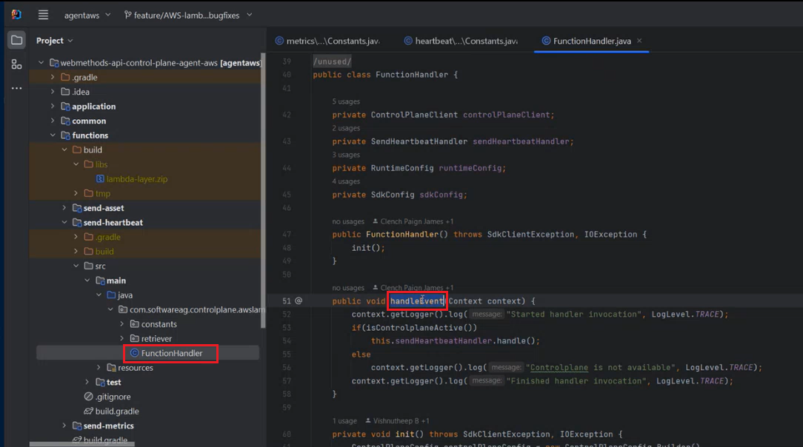
	For example, com.softwareag.controlplane.awslambda.heartbeat.FunctionHandler:: **handleEvent**
	3. Click **Save**.<br>
	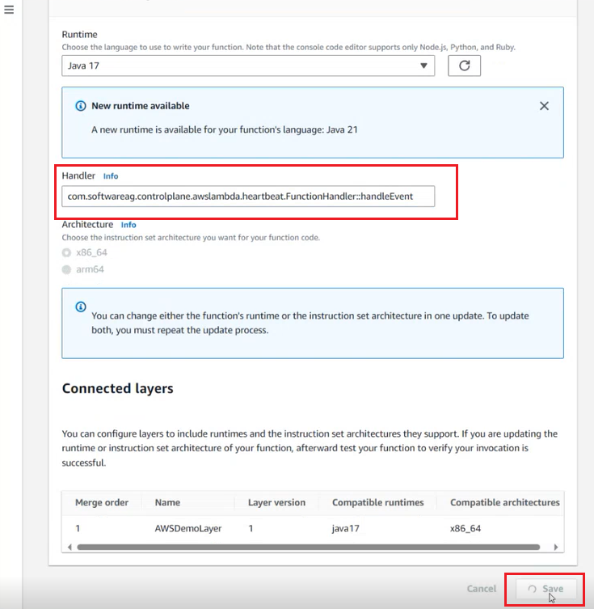<br>
	The Runtime settings are configured.

4. Specify the Environment variables.

   Environment variables include Amazon API Gateway, agent, runtime, and API Control Plane configurations. These configurations are required to connect Amazon API 
   Gateway with API Control Plane. 

	1. Click **Configuration > Environment variables**.
	2. Click **Edit**.
	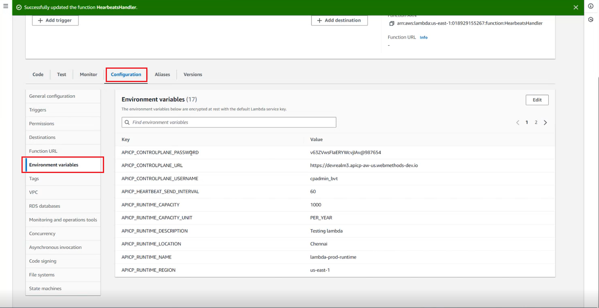
	3. Add the values against each Environment variable. For details about the variables and recommended value, see [How to run the Spring Boot application in Docker?](../application) 
           All the variables mentioned in that section are applicable for AWS Lambda except the AWS_ACCESS_KEY_ID, AWS_SECRET_ACCESS_KEY, AWS_REGION.


**Step 4: Specify the Amazon EventBridge Scheduler for the Heartbeatshandler Function.**

To set a trigger point for the *Heartbeatshandler* Function, leverage the *Amazon EventBridge Scheduler service*. 

To create an EventBridge Scheduler, you can either click **Add trigger** in the *Function overview* section of your Lambda function and choose **EventBridge (CloudWatch Events)** from the dropdown or use **AWS EventBridge Scheduler service** from the AWS services console.

The following procedure describes the steps to set a trigger using the AWS EventBridge Scheduler service from the AWS services console. Follow from *step 3* if you want to add a trigger from within your Lambda function:

  1. Search for *AWS EventBridge Scheduler service* in the Search bar in AWS services console.
	
  2. Choose **EventBridge Rule** in the right pane.
     
3. Click **Create Rule**.<br>
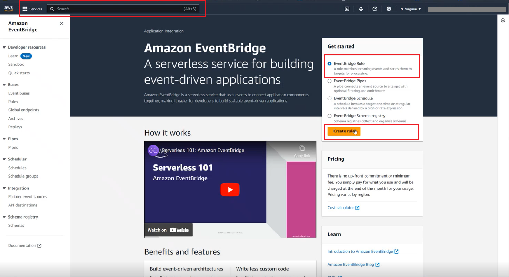
The *Define rule detail* page appears.<br>
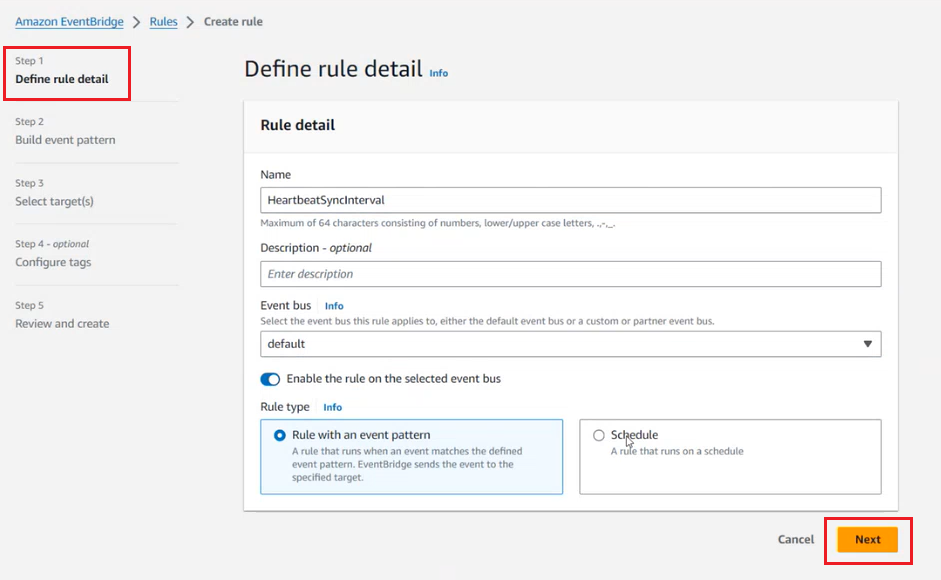

4. Specify the name of the rule.<br>
For example, **HeartbeatSyncInterval**.

5. Select the **Rule Type** as **Schedule**.
    
6. Click **Next**.<br>
The *Define schedule* page appears.<br>
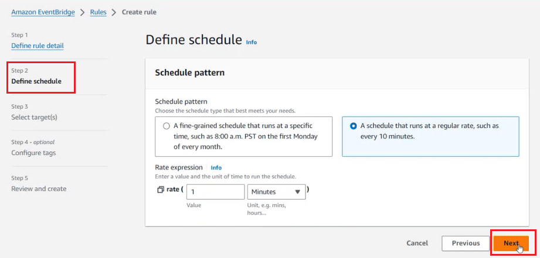

7. Choose the **Schedule pattern** as **A schedule that runs at a regular rate, such as every 10 minutes**.

8. **Rate expression**. Enter a value and the unit of time to run the schedule.<br>
For example: Value: **1**, Unit: **Minutes**<br>
**_Note_**: Ensure that the synchronization time interval values exactly match those in the environment variables. Specify the time intervals only in *minutes*, *hours*, or *days*; *seconds* are not allowed. For 	example, if *API_CP_HEARTBEAT_SEND_INTERVAL* is *60* seconds, set the *Amazon EventBridge* service Rate expression to *1* minute. Configure the Environment variables for the function to ensure that the time intervals in seconds can be easily converted to minutes without any decimal values.

9. Click **Next**.<br>
*Select target(s)* page appears.<br>
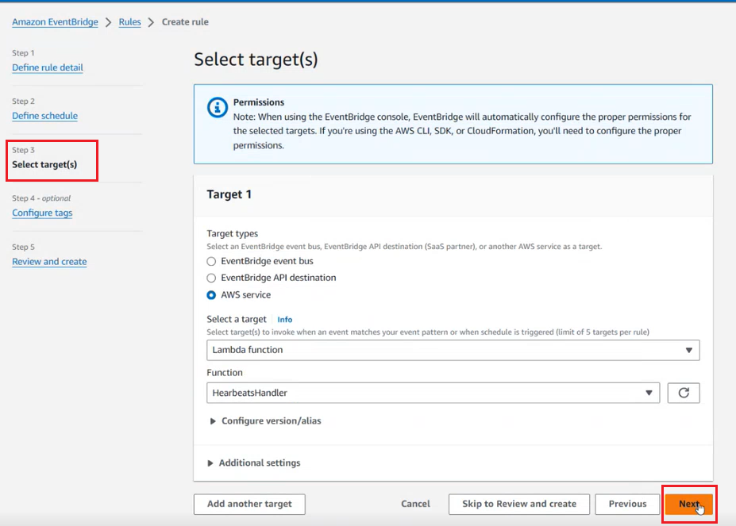

10. **Select a target**. Choose **Lambda function** to invoke when the schedule is triggered.

11. **Function**. Choose the Lambda function name. For example, *Heartbeatshandler*

12. Click **Next**.<br>
*Configure tags – optional* page appears.

13. Click **Next**.<br>
*Review and create* page appears.<br>
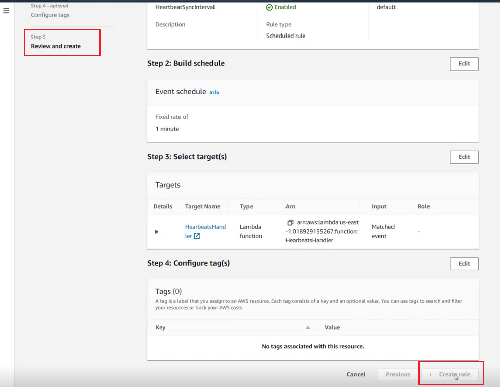

14. Click **Create rule**.<br>
The created rule gets associated with the *Heartbeatshandler Lambda function* and is enabled automatically. <br>
To verify if the EventBridge Scheduler is associated, open  *Heartbeatshandler Lambda function*, click **Configuration tab > Triggers**, and the EventBridge rule is displayed with the Rule state as **ENABLED**.
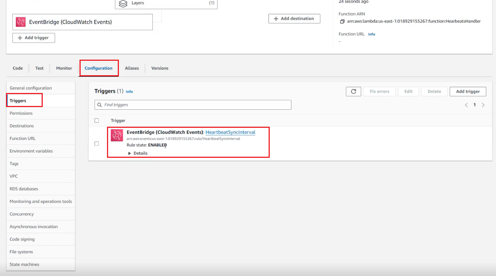<br>

As specified in the EventBridge rule, every 1 minute, the EventBridge triggers the Lambda function, **Heartbeatshandler** and the application logic within the Lambda function gets executed. That is, the agent  
retrieves AWS API Gateway’s heartbeats(status) and sends to API Control Plane. <br>
	
15. Verify if the runtime is registered with API Control Plane and if the heartbeats (status) are sent to API Control Plane successfully. 
    1. Open the API Control Plane application.<br>
    2. Click on the **Runtimes** tab.<br>
    3. Check if the AWS API Gateway (runtime) name specified in the Environment variables section is listed in the **Manage Runtimes** page.<br>
       If the runtime is listed, it indicates that the runtime is successfully registered with the API Control Plane.
    4. Check the status of that corresponding runtime in the **Status** column.
        The status appears *green* only if the runtime is up and the heartbeats (status) are received successfully by the API Control Plane.

**_Note_**: You must follow the same procedure to create and configure the Lambda functions for APIs and Metrics.<br> When you create and configure the Lambda functions for retrieving and sending APIs and metrics to API Control Plane, add the following class name and method name in the **Handler** field in the **runtime settings**:<br><br>For the **APIs** Lambda function, enter the following in the **Handler** field:<br> *com.softwareag.controlplane.awslambda.assets.FunctionHandler:: handleEvent*<br><br>For the **metrics** Lambda function, enter the following in the **Handler** field:<br> *com.softwareag.controlplane.awslambda.metrics.FunctionHandler:: handleEvent*<br>For details, see *Step 3: Specify the required configurations for the Lambda function, Heartbeatshandler to run.*<br><br>
Once configured, all the Lambda functions get automatically triggered based on the EventBridge scheduler, and the application logic of the respective Lambda functions gets executed, establishing the connection between Amazon Gateway and API Control Plane.<br>

Additionally, If you want to troubleshoot the executions of the lambda functions, the *Monitor* tab within the Lambda function enables you to monitor the *cloudWatch metrics* and the *Amazon cloudWatch logs* enable you to analyze all the requests handled by your Lambda function. For more details, see [Monitoring and troubleshooting Lambda functions](https://docs.aws.amazon.com/lambda/latest/dg/lambda-monitoring.html), [Cloud Watch Logs](https://docs.aws.amazon.com/lambda/latest/dg/monitoring-cloudwatchlogs.html), [Cloud Trail Events](https://docs.aws.amazon.com/lambda/latest/dg/logging-using-cloudtrail.html).
